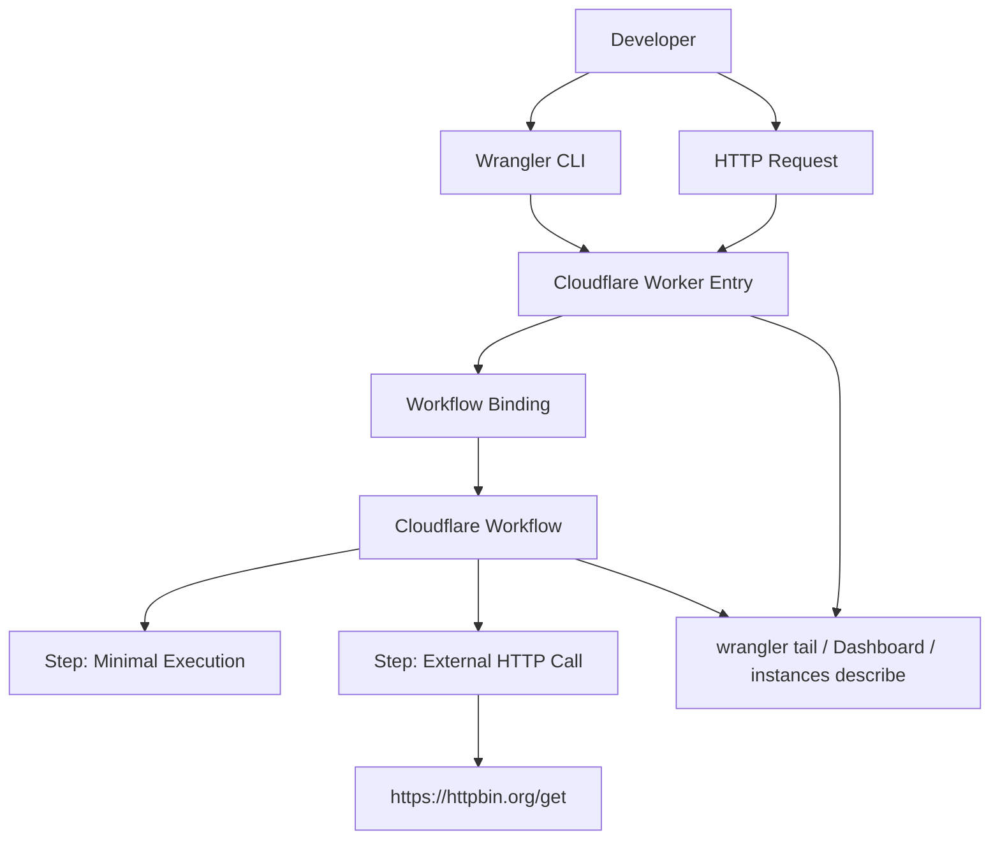
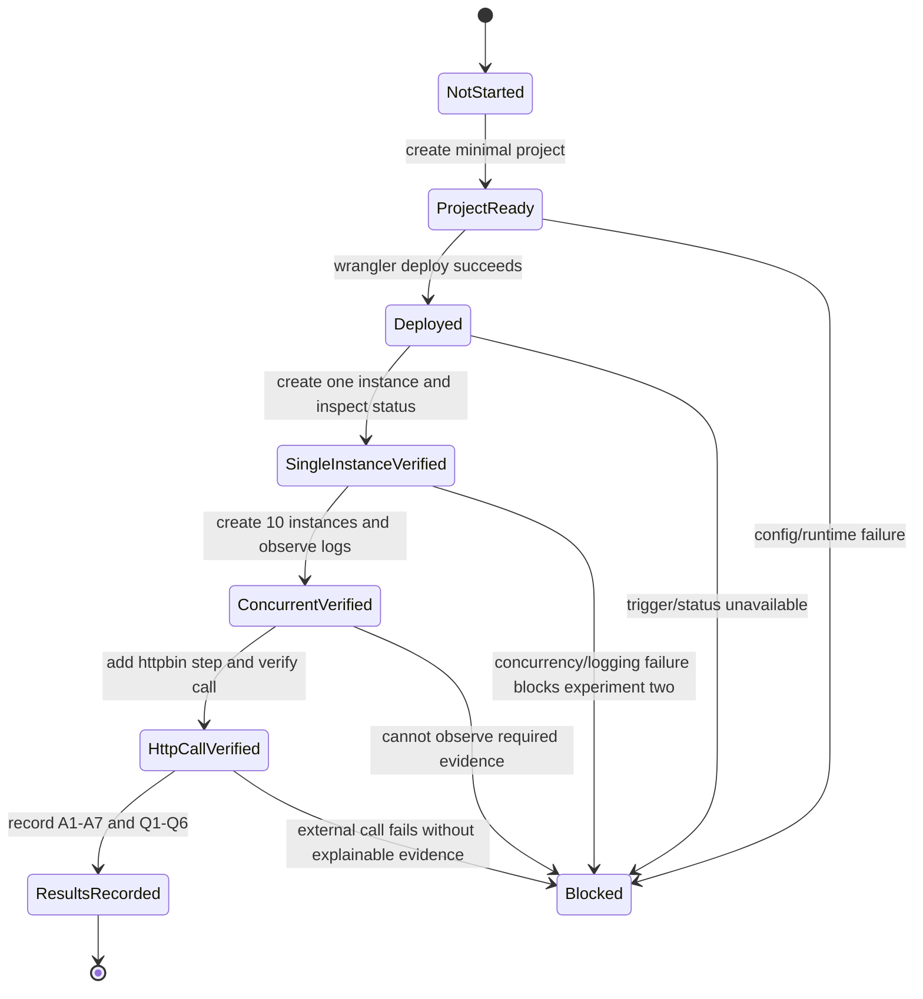
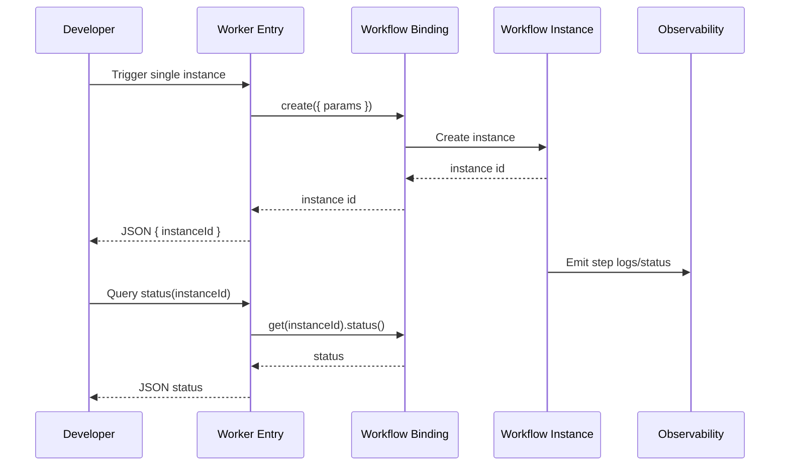
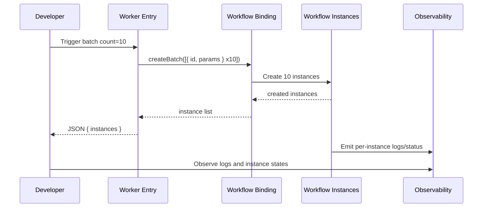
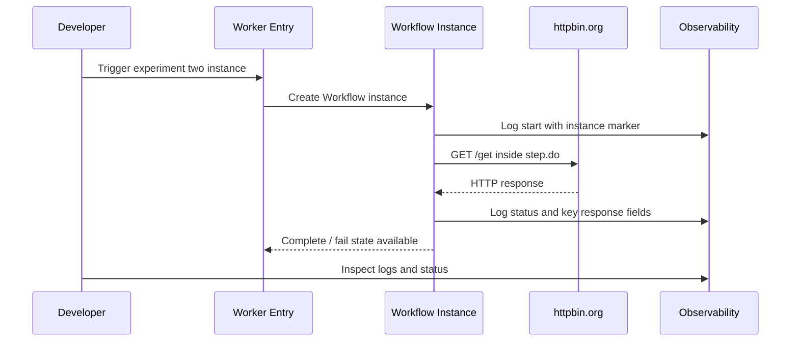

# flowablex-PLAN-003: Flowable 6.8 → Cloudflare Workflows 最小迁移实验计划

## Requirements

本计划承接 `WORKSHOP-004.md` 的结论：Flowable 6.8 → Cloudflare Workflows 的讨论已从理论 GAP 分析进入工程实践验证阶段。当前不做完整迁移架构，不实现运行时查询、历史查询、D1/R2、补偿、并行网关、多实例框架等补偿基础设施；只通过两个最小实验验证 Cloudflare Workflows 的基础能力是否足以支撑后续逐步迁移设计。

### Goals

- 建立一个最小 Cloudflare Workflows 工程实验，用事实验证 Workflow 可部署、可启动、可并发启动、可观测日志、可执行外部 HTTP 调用。
- 将 `WORKSHOP-004.md`、`C-037.md`、`C-038.md` 中的结论转化为可执行、可验收的工程阶段计划。
- 在实验结束后沉淀 A1-A7 假设的验证结果，为后续运行时状态、历史审计、可靠性、并发、可观测性等高阶设计提供实践依据。

### Non-Goals

- 不进行 Flowable 全量迁移。
- 不实现 BPMN 语义兼容层。
- 不实现用户任务、人工审批、任务中心、管理控制台。
- 不实现运行时查询、历史查询、审计存储、D1/R2/KV 持久化设计。
- 不实现并行网关、多实例框架、补偿事务、事件子流程等高 GAP 补偿设施。
- 不建立生产级可靠性、权限、安全、成本治理方案。

### Scope

- 创建一个最小 Cloudflare Workers + Workflows 项目。
- 配置 Wrangler 的 Workflow binding、入口 Worker、Workflow class。
- 实验一：部署并启动最小 Workflow，验证单实例启动、10 个实例并发启动、日志可观测、实例状态可检查。
- 实验二：在实验一同一 Workflow 定义上追加 `https://httpbin.org/get` 调用，验证外部 HTTP 调用、请求/响应日志、多实例外部调用行为。
- 记录每项验证点的证据、失败现象、限制、后续问题。

### Non-Scope

- 不接入真实业务系统或真实 Flowable 流程。
- 不接入需要鉴权的外部服务。
- 不设计复杂错误恢复、死信队列或补偿任务。
- 不引入数据库、对象存储、队列、Durable Object 作为当前实验必需依赖。
- 不做压力测试；10 个并发实例仅作为最小并发验证起点。

### Functional Requirements

#### 常规（Ubiquitous）需求

- **FR-001**: 系统应提供一个最小 Cloudflare Workflows 定义，用于执行可观测的测试步骤。
- **FR-002**: 系统应提供一个 Worker 入口，用于触发 Workflow 实例并返回实例 ID 或实例列表。
- **FR-003**: 系统应支持通过实例 ID 查询 Workflow 实例状态。
- **FR-004**: 系统应在 Workflow 执行过程中输出可区分实例的关键日志。
- **FR-005**: 系统应在实验二中调用 `https://httpbin.org/get` 并记录关键响应信息。

#### 事件驱动（Event-Driven）需求

- **FR-010**: 当开发者执行本地启动命令时，系统应能在本地环境启动 Worker 与 Workflow 实验入口。
- **FR-011**: 当开发者触发单个 Workflow 实例时，系统应返回可用于后续查询的实例 ID。
- **FR-012**: 当开发者触发 10 个 Workflow 实例时，系统应尽量通过批量创建方式启动多个实例，并返回创建结果。
- **FR-013**: 当开发者查询实例状态时，系统应返回该实例当前状态或错误信息。
- **FR-014**: 当 Workflow 执行外部 HTTP 调用时，系统应记录请求开始、响应状态、关键响应字段和实例标识。

#### 状态驱动（State-Driven）需求

- **FR-020**: 在实验一通过前，系统不得进入实验二实现阶段。
- **FR-021**: 在多个 Workflow 实例并发执行期间，日志应能区分不同实例或不同输入参数。
- **FR-022**: 在外部端点不可用期间，系统应记录失败原因，并将该失败作为实验结果而非静默忽略。

#### 非期望行为（Unwanted Behavior）需求

- **FR-030**: 如果 Cloudflare 部署失败，系统不得将实验一标记为通过。
- **FR-031**: 如果无法观察到 Workflow 执行日志，系统不得将日志能力验证标记为通过。
- **FR-032**: 如果 10 个实例无法全部创建或执行，系统不得将并发启动能力标记为完全通过，应记录限制、失败比例和错误信息。
- **FR-033**: 如果 `httpbin.org/get` 调用失败，系统不得将外部 HTTP 调用能力标记为通过，应记录状态码、异常或超时信息。

### Success Metrics

| Metric | Current | Target | How to Measure |
| --- | --- | --- | --- |
| Workflow 部署 | 未验证 | `wrangler deploy` 成功，部署后的 Worker URL 可访问 | 保存部署输出与访问结果 |
| 单实例启动 | 未验证 | 调用触发入口后返回实例 ID，实例可查询 | 调用入口并查询实例状态 |
| 多实例启动 | 未验证 | 一次实验启动 10 个实例，返回每个实例 ID 或创建结果 | 使用批量创建或脚本触发，记录结果 |
| 日志可观测 | 未验证 | 可通过 `wrangler tail`、Dashboard 或实例描述观察关键日志/状态 | 保存日志片段或观察记录 |
| 外部 HTTP 调用 | 未验证 | Workflow 成功调用 `https://httpbin.org/get` 并记录响应状态/关键字段 | 查看日志与实例状态 |
| 假设验证沉淀 | 未验证 | A1-A7 均标记为 confirmed / rejected / inconclusive | 形成实验结果表 |

### Dependencies

- **D-001**: Cloudflare 账号与 Workers/Workflows 可用权限。
- **D-002**: 本地 Node.js、npm/npx、Wrangler CLI 可用。
- **D-003**: Cloudflare 官方 Workflows 文档。
- **D-004**: 外部端点 `https://httpbin.org/get` 可访问。
- **D-005**: 开发者可使用 `wrangler dev`、`wrangler deploy`、`wrangler tail` 或 Dashboard 观察运行结果。

### Constraints

- **C-001**: 必须从最小实验开始，不一次性实现完整迁移架构。
- **C-002**: 实验一与实验二按顺序依赖执行：实验一通过后，在同一 Workflow 定义上追加 HTTP 调用能力。
- **C-003**: 当前实验优先验证基础能力，不引入 D1/R2/KV/DO 等补偿基础设施作为必需项。
- **C-004**: 并发验证起点为 10 个实例，后续是否提高并发度由实验结果决定。
- **C-005**: 日志观测优先使用 `wrangler tail`，Dashboard 与 `wrangler workflows instances describe` 作为补充观察手段。
- **C-006**: 实验输出必须区分“能力不支持”“配置错误”“配额/限制”“外部服务失败”四类结论。

### Assumptions

- **A-001**: Cloudflare Workflows 的部署流程与 Workers 相同，可通过 `wrangler deploy` 部署。
- **A-002**: 10 个 Workflow 实例并发启动不会触发不可接受的平台限流。
- **A-003**: Workflow 执行日志可通过 `wrangler tail`、Dashboard 或实例描述实时/准实时观察。
- **A-004**: Workflow 内部可发起对 `https://httpbin.org/get` 的外部 HTTP 请求。
- **A-005**: `httpbin.org/get` 在实验期间可访问且响应格式足够稳定。
- **A-006**: 单文件或极简 Workflow 定义足以覆盖实验一和实验二，无需引入 D1/R2/KV 绑定。
- **A-007**: 多实例并发启动时，可通过实例 ID、输入参数或日志字段区分各实例执行情况。

### References

- **REF-001**: `.context/WORKSHOP-004.md` — 迁移实验初始化总结。
- **REF-002**: `.context/C-037.md` — Goal LENS 实验目标澄清。
- **REF-003**: `.context/C-038.md` — Pilot LENS 收束判断。
- **REF-004**: `.context/current-task.md` — 当前实验定位与用户约束。
- **REF-005**: `.context/WORKSHOP-001.md` — 完整 BPMN 语义下不建议全量迁移，推荐混合模式。
- **REF-006**: `.context/WORKSHOP-002.md` — 自动化场景下迁移有条件可行。
- **REF-007**: `.context/WORKSHOP-003.md` — 8 项高 GAP 首轮分析总结。
- **REF-008**: Cloudflare Docs: Build your first Workflow。
- **REF-009**: Cloudflare Docs: Trigger Workflows。
- **REF-010**: Cloudflare Docs: Rules of Workflows。
- **REF-011**: Cloudflare Docs: Workflows Limits。
- **REF-012**: Cloudflare Docs: Workflows Pricing。

## Specs

- [ ] **SPEC-001**：最小 Workflow 工程骨架
  - **背景 / 目标**：实验需要先确认 Cloudflare Workflows 是否能以最小工程形态部署和运行。
  - **范围**：覆盖 Worker 项目初始化、Workflow class、Wrangler 配置、类型生成；不覆盖真实业务流程迁移。
  - **关键决策**：使用 Cloudflare 官方推荐的 Workers + Workflows binding 模式；Workflow class 继承 `WorkflowEntrypoint`，入口 Worker 通过 binding 调用 Workflow。
  - **实现约束**：
    - Wrangler 配置中应包含 `workflows` 配置项。
    - `class_name` 必须匹配导出的 Workflow class。
    - `binding` 名称应作为 Worker 入口访问 Workflow 的变量名。
    - 应开启可观测性配置以支持日志/状态观察。
  - **接口 / 对接点**：Wrangler 配置、Worker fetch handler、Workflow binding、Cloudflare Workflows runtime。
  - **命令 / 操作**：`npx wrangler dev`、`npx wrangler deploy`、`npx wrangler types`。
  - **验收（勾选即证据）**：
    - [ ] 本地开发服务可启动。
    - [ ] Wrangler 类型可生成。
    - [ ] Cloudflare 部署成功。
    - [ ] 部署后的 Worker URL 可访问。

- [ ] **SPEC-002**：实验一 — 最小 Workflow 部署、启动、并发与日志
  - **背景 / 目标**：验证 Cloudflare Workflows 的最小可运行能力，回答 A1/A2/A3/A6/A7。
  - **范围**：覆盖单实例启动、状态查询、10 实例并发启动、日志观察；不覆盖外部 HTTP 调用。
  - **关键决策**：先实现最小可观测步骤，例如记录实例参数、执行一个 `step.do`、可选短 `step.sleep`，用于观察状态变化。
  - **实现约束**：
    - 每个实例必须携带可区分标识，如 `runId` 或 `index`。
    - 并发实验起点为 10 个实例。
    - 多实例启动优先使用 `createBatch`，因为官方文档建议批量创建多个 Workflow invocation。
    - 日志必须包含实例标识或输入参数，避免多实例日志混杂。
  - **接口 / 对接点**：Worker HTTP 触发入口、`env.MY_WORKFLOW.create`、`env.MY_WORKFLOW.createBatch`、`env.MY_WORKFLOW.get`、`wrangler tail`、`wrangler workflows instances describe`。
  - **命令 / 操作**：调用 Worker 入口创建单实例；调用批量入口创建 10 实例；查询返回实例状态；观察日志。
  - **验收（勾选即证据）**：
    - [ ] 单实例触发后返回实例 ID。
    - [ ] 单实例状态可查询。
    - [ ] 10 个实例可被批量创建或脚本化启动。
    - [ ] 多实例执行日志可区分实例。
    - [ ] 可观察到 step 执行状态、输出、错误或重试信息。

- [ ] **SPEC-003**：实验二 — 外部 HTTP 调用
  - **背景 / 目标**：在实验一基础上验证 Workflow 内部能否调用外部 HTTP 服务，并观察多实例并发外部调用行为。
  - **范围**：覆盖调用 `https://httpbin.org/get`、记录请求/响应关键日志、10 实例外部调用观察；不覆盖鉴权、重试策略、真实业务 API。
  - **关键决策**：实验二复用实验一工程与 Workflow 定义，只追加一个外部调用 step，保持“从简单开始”。
  - **实现约束**：
    - 外部 HTTP 调用应放在 `step.do` 内，符合 Workflows 对可恢复步骤的推荐使用方式。
    - 日志应记录请求开始、响应状态、关键响应字段、实例标识。
    - 对失败响应或异常应记录错误，不应吞掉失败。
  - **接口 / 对接点**：`fetch("https://httpbin.org/get")`、Workflow step、Worker 触发入口、日志观察工具。
  - **命令 / 操作**：部署或本地运行实验二版本；触发单实例；触发 10 实例；观察日志和状态。
  - **验收（勾选即证据）**：
    - [ ] 单实例成功调用 `httpbin.org/get`。
    - [ ] 日志包含 HTTP 响应状态或关键字段。
    - [ ] 10 个实例执行外部调用时行为可观察。
    - [ ] 外部调用失败时能记录失败证据。

- [ ] **SPEC-004**：实验结果与假设回填
  - **背景 / 目标**：本实验的价值不是代码本身，而是形成后续迁移判断所需事实。
  - **范围**：覆盖 A1-A7 假设验证、Q1-Q6 未决问题记录、失败/限制/后续问题沉淀。
  - **关键决策**：实验结果应以表格形式记录 confirmed / rejected / inconclusive，避免只留下口头判断。
  - **实现约束**：
    - 每项验证点必须有证据来源。
    - 未验证项必须标记为 inconclusive，不得默认为通过。
    - 配额、价格、日志延迟、外部端点失败等非代码因素应单独记录。
  - **接口 / 对接点**：实验日志、部署输出、实例状态、Cloudflare 文档、执行者观察记录。
  - **命令 / 操作**：整理实验结果表；更新后续计划或创建下一阶段任务。
  - **验收（勾选即证据）**：
    - [ ] A1-A7 均有验证状态。
    - [ ] Q1-Q6 均有处理结论或后续动作。
    - [ ] 形成下一轮实验建议。

## Design

本设计只描述当前最小迁移实验的系统边界、触发方式、执行流程与观察点，不设计生产级迁移架构。

### 设计文档的定位（宏观 / 协调优先）

当前实验的设计目标是用最小 Cloudflare Workers + Workflows 工程验证基础能力，而不是替代 Flowable 的完整流程引擎能力。设计应服务于五个验证点：可部署、可启动、多实例并发启动、日志可观测、外部 HTTP 调用。

### Page & Component Inventory

#### 页面清单（0 个页面）

本实验无用户页面。所有交互通过 Worker HTTP 入口、Wrangler CLI、Cloudflare Dashboard 或日志观察工具完成。

#### 操作入口清单

- **E-001 本地开发入口**
  - **入口**：`npx wrangler dev`
  - **用户与权限**：本地开发者
  - **关键状态**：启动成功、配置错误、绑定错误、类型错误
  - **对接点**：Wrangler、本地 Worker runtime、Workflow binding
  - **观测点**：终端输出、本地请求响应

- **E-002 部署入口**
  - **入口**：`npx wrangler deploy`
  - **用户与权限**：具备 Cloudflare 部署权限的开发者
  - **关键状态**：部署成功、认证失败、配置失败、平台限制
  - **对接点**：Cloudflare Workers、Cloudflare Workflows、Wrangler 配置
  - **观测点**：部署输出、部署后的 Worker URL

- **E-003 单实例触发入口**
  - **入口**：HTTP 请求 Worker 触发路径或默认入口
  - **用户与权限**：开发者
  - **关键状态**：创建成功、创建失败、返回实例 ID
  - **对接点**：`env.MY_WORKFLOW.create`
  - **观测点**：HTTP 响应、实例状态、日志

- **E-004 多实例触发入口**
  - **入口**：HTTP 请求 Worker 批量触发路径或脚本化请求
  - **用户与权限**：开发者
  - **关键状态**：10 实例创建成功、部分失败、限流、错误返回
  - **对接点**：`env.MY_WORKFLOW.createBatch` 或脚本化 `create`
  - **观测点**：返回实例列表、日志、实例状态

- **E-005 状态查询入口**
  - **入口**：HTTP 查询实例 ID，或 `wrangler workflows instances describe`
  - **用户与权限**：开发者
  - **关键状态**：queued、running、waiting、complete、failed、unknown
  - **对接点**：`env.MY_WORKFLOW.get(instanceId)`、Wrangler Workflows CLI
  - **观测点**：状态响应、step 状态、错误信息

### Architecture Overview

### State Machine

### Sequence Diagrams

#### UC-001 单实例启动与状态查询

#### UC-002 多实例批量启动

#### UC-003 外部 HTTP 调用实验

### API Design

#### API-001 触发单个 Workflow 实例

**Endpoint**: `{GET|POST} /start`

**Description**: 创建一个 Workflow 实例，返回实例 ID。若实现阶段选择复用根路径，也可由 `/` 触发。

**Input**:

- `runId`：可选，用于日志区分。
- `experiment`：可选，取值可为 `minimal` 或 `http`。

**Output**:

- `instanceId`
- `runId`
- `experiment`

#### API-002 批量触发 Workflow 实例

**Endpoint**: `{GET|POST} /batch?count=10`

**Description**: 创建 10 个 Workflow 实例，用于验证多实例并发启动与日志可区分性。

**Input**:

- `count`：默认 10，当前实验不得默认扩大到压力测试规模。

**Output**:

- `instances[]`
- 每个实例的 `id`、`runId` 或创建结果。

#### API-003 查询 Workflow 实例状态

**Endpoint**: `{GET} /status?instanceId={id}`

**Description**: 查询指定 Workflow 实例状态，辅助判断 step 执行、失败、完成或等待状态。

**Input**:

- `instanceId`：必填。

**Output**:

- Workflow 实例状态。
- 错误信息，若实例不存在或查询失败。

### Observability Design

- 日志必须包含实验编号、实例标识、步骤名称、开始/结束/失败事件。
- 实验一至少观察部署输出、触发响应、实例状态、执行日志。
- 实验二至少观察 HTTP 请求开始、响应状态、关键字段、失败异常。
- `wrangler tail` 为优先观察方式；Cloudflare Dashboard 和 `wrangler workflows instances describe` 作为补充。
- 如果三种方式均无法获得足够证据，应将 A3 标记为 rejected 或 inconclusive。

### Experiment Result Schema

实验结束后应沉淀如下结果表：

| ID | 假设 / 问题 | 结果 | 证据 | 后续动作 |
| --- | --- | --- | --- | --- |
| A1 | 部署流程与 Workers 相同 | confirmed / rejected / inconclusive | 部署输出 | 下一步 |
| A2 | 10 实例并发启动不受限流影响 | confirmed / rejected / inconclusive | 批量创建结果 | 下一步 |
| A3 | 日志可实时/准实时观测 | confirmed / rejected / inconclusive | 日志截图/片段 | 下一步 |
| A4 | 可发起外部 HTTP 请求 | confirmed / rejected / inconclusive | httpbin 调用结果 | 下一步 |
| A5 | httpbin 可访问且返回稳定 | confirmed / rejected / inconclusive | 响应样例 | 下一步 |
| A6 | 极简定义足以覆盖实验需求 | confirmed / rejected / inconclusive | 实现记录 | 下一步 |
| A7 | 多实例日志可区分 | confirmed / rejected / inconclusive | 日志证据 | 下一步 |

## Phases

### PHASE-100: 实验准备与官方约束确认

本 Phase 聚焦于把 `WORKSHOP-004` 的结论转化为可执行实验前置条件，并确认 Cloudflare 官方文档中的关键用法和限制。

- [ ] **确认实验边界**: 复核当前实验仅验证可部署、可启动、多实例、日志、外部 HTTP 调用，不引入完整 Flowable 迁移架构或补偿基础设施。
- [ ] **确认 Cloudflare Workflows 基本用法**: 阅读并记录 `WorkflowEntrypoint`、`step.do`、`step.sleep`、Workflow binding、`create`、`get`、`createBatch` 的最小用法。
- [ ] **确认 Wrangler 配置要求**: 确认 `workflows.name`、`binding`、`class_name`、`compatibility_date`、`observability` 等配置项，避免部署阶段因配置缺失失败。
- [ ] **确认账号与环境前置条件**: 确认 Cloudflare 登录状态、Wrangler 可用、目标账号具备 Workers/Workflows 权限。
- [ ] **确认限制与计费认知**: 记录 Workflows 可用于 Workers Free，Workflow invocation 指新实例触发，计费与 Workers CPU/request/state 相关；当前 10 实例实验不应被误解为压力测试或成本评估。

### PHASE-200: 实验一工程骨架与单实例验证

本 Phase 聚焦于创建最小 Workers + Workflows 工程，并验证单个 Workflow 实例可部署、可触发、可查询。

- [ ] **创建最小工程骨架**: 初始化 Worker 项目，添加 Workflow class、Worker fetch 入口和 Wrangler workflows 配置。
- [ ] **实现最小 Workflow 步骤**: 在 Workflow 中实现至少一个可观测 `step.do`，返回可序列化结果，并包含实例参数或 `runId`。
- [ ] **实现单实例触发入口**: Worker 入口调用 Workflow binding 的 `create`，返回实例 ID 和实验参数。
- [ ] **实现实例状态查询入口**: Worker 入口根据 `instanceId` 调用 Workflow binding 的 `get` 并返回状态。
- [ ] **完成本地验证**: 使用 `wrangler dev` 启动本地环境，触发单实例并查询状态。
- [ ] **完成部署验证**: 使用 `wrangler deploy` 部署到 Cloudflare，调用部署后的 URL 触发单实例并查询状态。

### PHASE-300: 实验一多实例并发与日志验证

本 Phase 聚焦于验证 10 个 Workflow 实例的并发启动能力与日志可观测性，回答 A2/A3/A7。

- [ ] **实现批量触发入口**: 添加批量启动能力，默认创建 10 个带唯一标识的实例；优先使用官方建议的 `createBatch`。
- [ ] **补充可区分日志**: 在每个 Workflow 实例执行过程中记录 `runId`、实例参数、步骤名称、开始/结束状态。
- [ ] **执行 10 实例启动实验**: 触发 10 个实例，记录返回实例列表、失败项、限流或错误信息。
- [ ] **观察执行日志**: 使用 `wrangler tail` 优先观察日志；必要时使用 Dashboard 或 `wrangler workflows instances describe` 补充观察。
- [ ] **判定实验一结果**: 对可部署、可启动、多实例启动、日志可观测四项分别标记通过/失败/不确定，并记录证据。

### PHASE-400: 实验二外部 HTTP 调用验证

本 Phase 在实验一通过后执行，聚焦于在同一 Workflow 定义中追加 `https://httpbin.org/get` 调用能力。

- [ ] **追加外部调用 step**: 在 Workflow 中新增 `step.do` 调用 `https://httpbin.org/get`，记录请求开始、响应状态和关键响应字段。
- [ ] **执行单实例 HTTP 实验**: 触发一个实例，确认外部调用成功并能在日志或状态中观察到结果。
- [ ] **执行 10 实例 HTTP 实验**: 触发 10 个实例，观察多个实例同时执行外部调用时的行为。
- [ ] **记录失败与异常**: 若出现超时、非 2xx、解析失败、网络失败或平台限制，记录为实验事实，不以重试或规避掩盖。
- [ ] **判定实验二结果**: 对外部 HTTP 调用、请求/响应日志、多实例外部调用行为分别标记通过/失败/不确定。

### PHASE-500: 实验结论沉淀与下一轮输入

本 Phase 聚焦于将实验事实回填到 `WORKSHOP-004` 形成的假设和未决问题中，为后续更大规模设计提供输入。

- [ ] **回填 A1-A7 假设表**: 将部署、并发、日志、HTTP、单文件定义、日志区分等假设标记为 confirmed / rejected / inconclusive。
- [ ] **处理 Q1-Q6 未决问题**: 记录并发度起点、日志观测方式、绑定配置观察、配额/定价认知、外部鉴权暂不涉及、启动方式选择。
- [ ] **总结工程事实**: 输出哪些能力可直接使用、哪些需要补偿、哪些仍需下一轮实验确认。
- [ ] **提出下一轮实验建议**: 根据结果决定是否进入运行时状态/历史审计联合设计，或先补充可靠性、重试、错误处理、实例查询等中间实验。
- [ ] **保留最小实验产物**: 若实验产物可作为后续基础，则保留命名与部署记录；若不再需要，则记录清理建议与清理前提。
