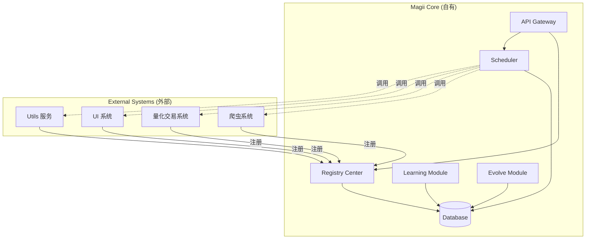

# 自我学习与进化机制 Vision

> 本 Vision 由外部 Agent 负责更新进度。本仓库 Agent 只读取，不介入实现细节。

## Requirements

### Goals

- 实现基于反馈的自我学习能力，使系统能够从经验中改进
- 实现基于学习结果的自我进化能力，渐进式优化调度策略
- 完成 Magii 各模块集成验证，确认系统整体可运行

### Scope

- Learning Module：反馈采集、学习策略、效果评估
- Evolve Module：进化触发条件、进化策略、进化验证
- 集成验证：注册中心、调度中心、学习、进化模块联合验证

### Non-Scope

- 注册中心实现（LSTD-002，已暂停）
- 调度中心实现（LSTD-003）
- 大规模数据训练
- 生产环境级别的优化

### Constraints

- 进化过程可追溯，保留回滚能力
- 自我学习从小规模场景开始验证
- 记录调度过程中的决策与结果
- 支持多种学习策略
- 依赖 LSTD-003 完成后才可进入

### System Context

## Visions

- [ ] **V-300**: 复核 LSTD-003 是否已完成并满足进入本 Vision 的前置条件
  - **Dependencies**: LSTD-003 完成（V-299 in LSTD-003）
  - **Do**: 复核 LSTD-003 的完成状态与验收点 -> {输出：LSTD-003 完成确认（或缺口清单）}
  - **Check**:
    - LSTD-003 相关条目均已 `- [x]`
    - IF PASS  : 将 Act 设置为 PASS and Continue to V-301
    - ELSE FAIL: 将 Act 设置为 Pause and HITL，{未完成项/阻塞点清单}
  - **Act**: {根据 Check 的结果设置}

- [ ] **V-301**: 实现 Learning Module
  - **Dependencies**: V-300
  - **Do**: 实现基于反馈的学习核心逻辑 -> {输出：学习模块代码}
  - **Check**:
    - 能够基于反馈进行学习并更新策略
    - IF PASS  : 将 Act 设置为 PASS and Continue to V-302
    - ELSE FAIL: 将 Act 设置为 Pause and HITL，{失败原因/阻塞点}
  - **Act**: {根据 Check 的结果设置}

- [ ] **V-302**: 实现 Evolve Module
  - **Dependencies**: V-301
  - **Do**: 实现自我进化核心逻辑 -> {输出：进化模块代码}
  - **Check**:
    - 能够基于学习结果调整调度策略
    - 进化过程可追溯
    - IF PASS  : 将 Act 设置为 PASS and Continue to V-303
    - ELSE FAIL: 将 Act 设置为 Pause and HITL，{失败原因/阻塞点}
  - **Act**: {根据 Check 的结果设置}

- [ ] **V-303**: 集成验证
  - **Dependencies**: V-302
  - **Do**: 集成各模块并进行整体验证 -> {输出：验证结果}
  - **Check**:
    - 注册中心功能正常运行
    - 调度中心功能正常运行
    - 自我学习功能正常运行
    - 自我进化功能正常运行
    - 系统整体可运行
    - IF PASS  : 将 Act 设置为 PASS and Continue to V-399
    - ELSE FAIL: 将 Act 设置为 Pause and HITL，{失败原因/阻塞点}
  - **Act**: {根据 Check 的结果设置}

- [ ] **V-399**: Vision 收尾判断
  - **Dependencies**: V-303
  - **Do**: 复盘本 Vision 产出与 Vision 规范一致性 -> {输出：需要返修的点（如有）与修改建议}
  - **Check**:
    - 是否存在关键变更/口径不一致/验收标准不清导致后续不可执行
    - IF PASS  : 将 Act 设置为 PASS and Pause and HITL，{Vision 收尾确认}并提问{是否进入下一个 Vision（含可选项）}
    - ELSE FAIL: 将 Act 设置为 Pause and HITL，{需要返修点清单}
  - **Act**: {根据 Check 的结果设置}
