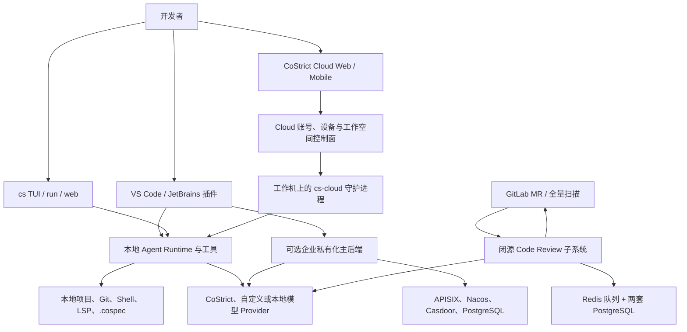

# CoStrict 技术产品调研

> updated_by: Codex - GPT-5.6
> updated_at: 2026-07-27 22:51:41
> evidence_window: 2026-07-27；官网、官方文档、官方 GitHub 仓库与 Release、VS Code Marketplace 公开快照

## 交付结论

1. **CoStrict 是一套以本地编码执行为主体、以企业研发流程标准化为卖点的 AI 编码产品族，不是通用中心任务调度器。** 它同时提供 VS Code/JetBrains 插件、`cs` CLI、浏览器远程工作空间 CoStrict Cloud，以及可私有化部署的企业后端。
2. **它最有辨识度的能力是把单次编码需求展开为可审阅的多阶段 Agent 流程。** StrictPlan 会经历项目探索、需求澄清、方案和任务生成、子 Agent 执行、完成标记与修复；StrictSpec 进一步固定为需求、架构、计划、分派和实现五个阶段，并将中间产物写入 `.cospec/`。
3. **多 Agent 主要发生在单个项目或会话内部。** 探索 Agent、PlanManager、SpecPlan、SubCodingAgent、TDD Agent 等按角色分工，能够并行探索或分派编码任务；公开证据未显示核心产品具备组织级通用任务池、远程 Worker 租约、原子抢占、优先级队列或跨节点故障接管。
4. **CoStrict Cloud 是远程控制面，不等同于云端代跑编码任务。** 用户在本地 PC 或私有服务器运行 `cs-cloud` 守护进程，Cloud 以“设备 + 项目目录”创建工作空间，浏览器和移动端远程查看会话、文件、Diff、Git 与终端。主体文件和 Shell 操作仍在注册设备上执行，但账号、设备注册、工作空间控制与知识中心依赖 CoStrict 云端。
5. **本地权限面较大，默认治理需要主动收紧。** CLI 文档明确写明默认允许所有动作；`build` Agent 是 full-access，Cloud 还支持工作空间级自动审批。可以把编辑和 Bash 改为 `ask`、使用只读 `plan` Agent，并按项目限制工具，但这些不是默认强制门禁。
6. **开源不是全产品等价开源。** VS Code 插件主仓库采用 Apache-2.0，CLI 仓库采用 MIT，企业后端仓库采用 Apache-2.0；但增量扫描和全量扫描使用的 Code Review 子系统被官方明确标为闭源商业组件，需要镜像凭据和许可证。
7. **私有化主平台是 Docker Compose 微服务栈，不是轻量单二进制。** 官方最低建议为 x64 16 核、32 GB RAM、512 GB 存储，依赖 Docker 20.10+、Compose 2.0+、PostgreSQL、Nacos、Casdoor、APISIX 和模型服务。可选 Code Review 子系统再引入两套 PostgreSQL、Redis、六个业务服务及可选 GitLab。
8. **产品维护活跃，但文档与发布物存在明显版本漂移。** 插件 `main` 清单和 Changelog 为 3.0.17，CLI 最新 Release 为 3.0.35，私有化部署最新 Release 为 v0.0.7；文档仍出现 CLI 1.0.180、部署 v0.0.3、Higress 已移除与仍依赖 Higress 等冲突，正式部署前必须以实际 Release 包和 Compose 清单复核。
9. **对 Agent 自主工作议题的价值在“流程治理和本地持续执行”，不在“中心调度替代”。** CoStrict 适合作为复杂编码需求的本地/私有化 Agent 工作台、规范化执行器和远程观察入口；若目标是组织级持续派单、跨机器抢占、租约恢复和统一完成验收，仍需要外部任务系统或新增调度层。

## 调研目标、范围与边界

### 调研目标

- 说明 CoStrict 为谁解决什么问题，工作如何产生、分派、执行、验证和反馈。
- 区分插件、CLI、Cloud、企业后端与 Code Review 子系统的运行边界。
- 判断其开源范围、本地执行程度、私有化成本、权限治理和成熟度。
- 评估它在“Agent 持续获得工作并形成可治理完成闭环”议题中的位置。

### 核心问题

- CoStrict 的主要用户、产品形态和核心工作流是什么？
- StrictPlan、StrictSpec、TDD 与安全扫描如何组织父子 Agent？
- 本地设备、Cloud 控制面、模型 Provider 和企业后端如何协作？
- 哪些组件开源，哪些能力需要闭源镜像或商业许可证？
- Windows/macOS 是否可安装，主体编码执行发生在哪里？
- 当前版本、公开维护状态和文档冲突反映了什么风险？

### 覆盖范围

- [CoStrict 官网](https://costrict.ai/)及官方文档中的插件、CLI、Cloud 和私有化部署说明。
- [`zgsm-ai/costrict`](https://github.com/zgsm-ai/costrict) 插件主仓库、清单、Changelog、隐私声明和公开 Issue。
- [`zgsm-sangfor/opencode`](https://github.com/zgsm-sangfor/opencode) CLI 仓库及 3.0.35 Release。
- [`zgsm-ai/costrict-enterprise`](https://github.com/zgsm-ai/costrict-enterprise) 企业后端仓库。
- [`zgsm-sangfor/costrict-deploy-docker`](https://github.com/zgsm-sangfor/costrict-deploy-docker) 私有化部署 Release。
- VS Code Marketplace 稳定插件公开安装量和评分快照。

### 明确排除

- 不安装、运行或登录 CoStrict，不连接真实仓库、模型、GitLab、企业微信或 Cloud 账号。
- 不做完整源码审计、性能测试、安全渗透、数据合规审计或成本测算。
- 不调查 CoStrict Cloud 服务端内部实现、SLA、扩缩容和数据保留策略。
- 不把公开 Issue 个案外推为总体故障率。
- 不做竞品排名或为 Glintz 设计具体改造方案。

## 证据口径

- **官网与 README**用于确认定位和产品面；宣传性表述不直接视为已验证能力。
- **官方文档**用于确认工作流、安装、权限、Cloud 和私有化边界；与 Release 冲突时以当前 Release 资产为准。
- **GitHub 可见清单和目录**只用于定点确认版本、许可证、入口和服务组成，不代表完整源码审计。
- **Release 页面**用于确认当前公开版本、平台资产和方向性变化。
- **隐私声明**用于记录官方的数据处理承诺，不等同于独立合规验证。
- **Marketplace 与 Issue 快照**只描述 2026-07-27 的公开状态；安装量、Star 和 Issue 数不等同于质量或活跃用户数。

本次证据获取有三项限制：官方文档 sitemap 被客户端拦截；两个大型仓库的浅克隆在一次重试后仍未完整检出；Marketplace 的 Version History 标签无法打开。因此报告没有声称穷举全部文档或完成固定提交的全仓检索，精确 Marketplace 已发布版本保留为未决。

## 产品调研

### 产品定位与目标用户

CoStrict 将自己定义为“面向严肃开发的 AI Coding Platform”和“企业级 Strict AI Coder”。它不是单一补全插件，而是把 Agent 对话、代码生成、项目知识、规范化需求流程、测试、代码审查、安全扫描、模型接入与私有化后端组合成一套研发工作台。

主要目标用户包括：

- 希望在 VS Code、JetBrains 或终端中使用本地编码 Agent 的个人开发者。
- 需要把需求分析、设计、任务拆解、编码和测试固化为可审阅流程的工程团队。
- 需要自有模型、内网部署、统一身份和代码不出域能力的企业。
- 需要从浏览器或移动端观察和继续本地长任务的开发者。
- 需要 GitLab MR 增量审查或集中式全仓安全扫描的企业安全团队。

### 产品形态

| 产品面 | 当前形态 | 主体运行位置 | 关键边界 |
| --- | --- | --- | --- |
| VS Code 插件 | Marketplace 稳定版与 nightly；开源仓库 | VS Code Extension Host 与本地工作区 | 依赖 VS Code、本地文件权限和模型 Provider |
| JetBrains 插件 | 独立公开仓库与下载入口 | JetBrains IDE 与本地工作区 | 本次未定点核验版本和兼容矩阵 |
| `cs` CLI | TUI、`cs run`、`cs web`、ACP | 本地终端或服务器 | 内置文件/Shell/Web/MCP 工具，默认权限较宽 |
| CoStrict Cloud | Web/移动控制面 + 本地 `cs-cloud` | 代码和 Shell 在注册设备；控制面在云端 | 需要同一 Cloud 账号、设备在线和网络连接 |
| 企业主后端 | Docker Compose 微服务 | 企业自有服务器 | 需要数据库、认证、网关和模型服务 |
| Code Review 子系统 | 单机 Compose，可水平扩展 checker | 企业自有服务器 | 闭源商业镜像；服务于增量/全量扫描，不是通用 Agent 调度 |

### 工作如何产生

CoStrict 的编码工作仍主要由人显式发起：

- 在插件或 TUI 中输入需求，或引用需求文档、文件和目录。
- 通过 `cs run "prompt"` 从脚本或自动化流水线触发一次非交互任务。
- 在 Cloud 中进入某个“设备 + 项目目录”工作空间，新建或继续会话。
- 在 GitLab MR 事件到达时，由闭源 Code Review 子系统自动创建增量扫描任务。
- 在集中式安全平台中，由用户选择仓库、目录或文件启动全量扫描。

公开证据没有显示核心编码 Agent 会主动巡检组织任务池并自行认领通用开发任务。事件驱动能力目前最明确地出现在 GitLab 代码审查，而非通用编码任务调度。

### StrictPlan 工作闭环

1. 用户切换到 StrictPlan 并启动新会话，输入需求或引用需求文档。
2. AI 根据需求启动多个探索子 Agent，理解当前项目结构和实现现状。
3. AI 基于探索结果向用户发起需求澄清问卷，保留人工方向选择。
4. 系统生成变更清单和开发任务清单，允许人工或 AI 修改。
5. 用户确认后启动 PlanApply；PlanApply 作为任务管理 Agent，将 `task.md` 中任务分给 SubCodingAgent。
6. 子 Agent 完成一项或一批任务后，在 `task.md` 中写入完成标记。
7. 完成后用户可以调用 ReviewAndFix 修复遗漏，或进入 TDD 阶段进行编译和测试闭环。

这个闭环把“计划、分派、执行、进度记录、复查”放进项目文件和会话，但完成标记仍是 Agent 工作流状态，不等同于独立业务验收。

### StrictSpec 工作闭环

StrictSpec 面向更复杂需求，把过程固定为五个阶段：

1. 原始输入写入 `.cospec/spec/<feature-name>/user.md`。
2. Requirement Agent 澄清需求并生成 `spec.md`。
3. DesignAgent 按 C4 L1-L4 与 ADR 生成 `project.md`，需要用户确认架构。
4. TaskPlan 将需求和设计转换为 `plan.md`。
5. PlanManager 按任务相关性和依赖分派给 SpecPlan；SpecPlan 再生成 proposal、task、执行编码、检查完成并归档。

PlanManager 会在每项任务完成后更新 `plan.md`。这是一种项目内的文件式计划账本和父子 Agent 编排，不是带租约、优先级和分布式一致性的中心队列。

### TDD 与安全反馈闭环

`/test` 会依次调用 RunAndFix、TestDesign、TestAndFix：

- 先编译或验证可运行性并修复编码缺陷。
- 从方案、历史上下文、变更文件和近期提交推导测试需求，再由用户确认。
- 生成 `.cospec/test-plans/` 下的测试点与测试用例。
- 执行测试并继续修复代码问题。
- 若项目没有 `TEST_GUIDE.md`，TestPrepare 会从 AGENTS、开发文档、包清单、Makefile、脚本目录和语言框架推导测试指导，确认后复用。

CLI 安全扫描可针对文件、目录或 Git 分支执行，在项目本地生成摘要、单文件 JSON 和合并 JSONL 报告；危险操作需要人工确认。企业 Code Review 子系统则将 GitLab MR 事件进入 Redis 队列，由 review-worker 和 review-checker 消费，再由 issue-manager 去重并回写评论。

### Cloud 的持续运行与人工介入

CoStrict Cloud 通过 `csc cloud start` 在工作机启动本地守护进程，向云端注册设备。每个工作空间绑定一个设备目录，Cloud 提供：

- 多工作空间和多会话状态预览。
- 未读回复、权限请求和问卷待办提示。
- 浏览器/移动端文件、Diff、Git 和 Web 终端。
- 企业微信通知与自然语言回应，将授权、拒绝或补充说明传回会话。
- 工作空间级自动权限审批。
- 同一设备下跨工作空间引用目录或文件。
- Skill、Subagent、Command、MCP 和 Plugin 的个人/组织分发。

它改善了长任务的远程观察和异步接力，但设备必须在线，且没有公开证明 Cloud 会在设备离线后迁移任务到其他 Worker。

### 维护状态与公开反馈

- 插件主仓库公开快照约 4.3k Star、192 Fork、6,554 次提交，2026-07-27 当天仍有更新。
- `main` 的扩展清单和 Changelog 版本为 **3.0.17**；该值只证明源码快照，不代表 Marketplace 已发布版本。
- VS Code Marketplace 页面显示约 **15,096 次安装**、13 条评分，并同时存在 stable 与 nightly 入口。
- CLI 最新 Release 为 **3.0.35**，发布于 2026-05-14，提供 Windows x64/x64-baseline/ARM64、macOS x64/x64-baseline/ARM64、Linux x64/x64-baseline/ARM64 与 musl 资产。
- 私有化部署最新 Release 为 **v0.0.7**，发布于 2026-06-01；v0.0.6 增加 ARM，v0.0.5 移除主平台 Higress 与 MySQL。
- 插件仓库有 5 个开放 Issue、77 个已关闭 Issue。开放样本涉及 CLI 3.0.35 工具执行中止、Windows 跨窗口变更检测、MCP allowlist 覆盖和语言支持。

维护判断为：**活跃、功能扩张快、接口和文档仍在收敛。** Cloud、CLI、插件和后端的版本线彼此独立，不能只看单一版本号判断整套产品状态。

## 技术架构调研

### 系统全貌

### 本地执行面

插件运行在 IDE Extension Host 中，通过 Webview 提供交互，访问本地工作区、终端、Git、代码索引和模型 SDK。当前清单要求 VS Code `^1.93.1`、Node `>=20.19.2`，并包含本地启动 `cs-cloud`、连接 OpenCode-compatible API、代码审查、Security Review、Auto Commit 等入口。

CLI 基于 OpenCode 演进，提供：

- `cs` TUI 多会话界面。
- `cs run` 非交互脚本入口。
- `cs web` 浏览器界面和可配置本地 Server。
- 本地文件读写、Bash、代码搜索、Web 请求、LSP、MCP、Plugin、Skill 和 ACP。
- build、plan、general 以及 Wiki、StrictPlan、SubCoding、TaskCheck、TDD 等专用 Agent。

当前公开资料未显示本地执行依赖 PostgreSQL、Redis 或外部消息队列。项目计划、测试指导和部分工作状态以文件形式写入仓库；会话内部状态和完整持久化 schema 本次未做源码核验。

### Cloud 远程控制链路

1. 用户在工作机登录 CLI 并运行 `csc cloud start`。
2. CLI 下载必要组件，启动本地 `cs-cloud` 守护进程并注册设备。
3. Cloud Web 用同一账号列出在线设备，用户选择设备目录创建工作空间。
4. 浏览器通过 Cloud 控制面连接本地服务，查看会话、文件、Diff、Git 和终端。
5. Agent 工具在工作机目录内执行；本地日志默认位于 `~/.costrict/cs-cloud/app.log`。
6. 移动端或企业微信可以响应权限请求和问卷，继续原会话。

Release 3.0.26 说明终端通道切换到 cloud SSE/WS API，但本次没有核验协议、加密、反向连接、断线租约和重放实现。Cloud 是中心控制入口，却没有公开证据表明它承担通用编码 Worker 调度。

### 企业私有化主后端

官方当前部署口径为 Docker Compose 微服务栈：

- APISIX 作为统一入口。
- Casdoor 负责身份认证。
- Nacos 负责模型与服务配置。
- PostgreSQL 保存后端业务数据。
- chat-rag、client-manager、code-completions、codebase embed/query、credit-manager 等服务组成主要业务面。
- 聊天模型需要 OpenAI-compatible `/v1/chat/completions`，补全模型需要 `/v1/completions`。

自部署模型完整时，文档声称 Agent、Code Review 和 Completion 可不访问 CoStrict 在线 API。该结论来自官方部署说明，本次未做流量验证。

### Code Review 子系统

Code Review 子系统不是主仓库 Apache-2.0 能力的简单开关，而是官方明确标注的**闭源商业组件**。其职责为：

- GitLab MR Webhook 进入 review-manager。
- review-worker 消费 Redis 异步队列。
- 可水平扩展的 review-checker 调用模型审查 Diff。
- issue-manager 去重、修正行号并回写 GitLab。
- security-manager、security-platform、security-checker 承担全量 SAST。
- 两套 PostgreSQL 分别保存主审查与 SAST 数据。

这套队列只服务代码扫描，不应被外推为 CoStrict 已有通用编码 Agent 任务调度器。

### 配置、持久化与扩展

CLI 配置采用 JSON/JSONC，按以下优先级合并：远程组织配置、`~/.config/costrict/costrict.json`、自定义配置、项目根 `costrict.json`、`.costrict/` 目录和内联环境变量。

可确认的本地状态包括：

- `.cospec/spec/`：原始需求、需求规格、架构和总计划。
- `.cospec/plan/changes/` 与 `archive/`：子功能方案、任务和归档。
- `.cospec/test-plans/` 与 `TEST_GUIDE.md`：测试设计与项目测试指导。
- `~/.config/costrict/` 与项目 `.costrict/`：用户和项目配置、Agent、Command、Plugin。
- `~/.costrict/cs-cloud/app.log`：Cloud 本地守护进程日志。

扩展面包括自定义 Agent、Command、Rule、Tool、Model Provider、MCP、LSP、ACP、JS/TS Plugin 和 Skill。Cloud 知识中心可向个人或组织分发这些能力，并显示风险等级。

## 部署与平台边界

### Windows 与 macOS

- VS Code 插件最低要求应以当前清单 `^1.93.1` 为准；安装文档仍写 1.93.0。
- CLI 支持 Windows 10+、macOS 10.15+ 和 Linux 4.0+。
- 3.0.35 Release 实际包含 Windows x64、x64 baseline、ARM64，macOS Intel、Intel baseline、Apple silicon，以及多种 Linux 包。
- macOS CLI 二进制可能未签名，官方提供移除 Gatekeeper quarantine 的处理方式；签名、公证和企业软件分发状态需实机确认。
- Windows 文档在权限失败时建议管理员终端，但没有明确声明所有正常安装都必须管理员权限。
- Windows 7 只允许把 CLI Web 服务运行在远程 Linux 或通过 VS Code Remote 使用，不属于本地 TUI 正式支持。

### 企业主后端

官方最低建议：

- x64 CPU 16 核；ARM 需联系官方确认。
- 32 GB RAM。
- 512 GB 可用存储。
- CentOS 7+ 或 Ubuntu 20.04+，支持 WSL。
- Docker 20.10+ 与 Docker Compose 2.0+。
- 可用的聊天和补全模型服务。

支持联网自动拉取镜像，也支持预先导出镜像后离线部署。该方式适合内网，但不是无依赖的单机桌面应用。

### Code Review 子系统

Code Review 需要额外的闭源镜像凭据、许可证、Redis、两套 PostgreSQL、六个业务镜像以及可选 GitLab。review-checker 可以水平扩展，说明其扫描吞吐可通过副本数调整；未公开高可用、跨主机队列恢复和容量基准。

## 权限、安全与数据边界

### 默认权限

- CLI 文档明确写明默认允许所有动作。
- build Agent 为 full-access；plan Agent默认禁止编辑，并在 Bash 前询问。
- Cloud 可按工作空间开启自动权限审批。
- 可在 `costrict.json` 中禁用 write/bash，或设置为 `ask`。

因此，CoStrict 的治理能力是“可配置”，不是默认最小权限。敏感仓库应使用专用工作区、只读计划阶段、逐项审批、受限模型凭据和独立 Git 分支。

### 数据与遥测

根据官方隐私声明：

- 文件、Prompt 和相关上下文会发送给用户选择的模型 Provider。
- 使用 CoStrict Cloud 代理模型时，代码和 Prompt 可能经过 CoStrict 服务器；官方声称仅转发且不存储。
- API Key 存在本地，仅发送给所选 Provider。
- PostHog 遥测默认开启，包含 VS Code machine ID、功能使用和异常报告；官方声称不收集代码和 Prompt，可在设置中关闭。
- Marketplace 搜索会向 CoStrict 后端发送版本、搜索词等必要参数。

这些是供应商声明，不等于独立验证。对私有化和高敏感代码，应通过网络抓包、日志、DNS allowlist 和出口代理实测确认。

### 部署安全基线

部署文档示例包含 Nacos `nacos/nacos`、测试用户 `costrict/123`、SAST 管理账号和 GitLab root 默认凭据。文档虽提示生产环境替换数据库密码，但没有给出完整加固清单。正式部署至少需要：

- 更换所有默认账号、数据库密码、APISIX Admin Key 和模型 API Key。
- 限制 Nacos、Casdoor、数据库、Redis、Swagger 和队列监控端口的网络暴露。
- 为 GitLab PAT 使用最小作用域和可轮换的专用账号。
- 禁止在生产环境使用自动审批，或只允许经过 allowlist 的工具和命令。
- 验证镜像来源、摘要、许可证和离线包完整性。

## 对 Agent 自主工作议题的判断

| 维度 | CoStrict 当前能力 | 成熟度判断 |
| --- | --- | --- |
| 工作产生 | 人工 Prompt/文档、脚本 `cs run`、GitLab MR 事件 | 人工触发成熟；通用事件接单有限 |
| 任务拆解 | StrictPlan/StrictSpec 生成方案、任务和文件账本 | 产品化程度较高 |
| Agent 分派 | PlanApply/PlanManager 向专用 Subagent 分派 | 项目内编排成熟；组织级调度不足 |
| 持续推进 | 子 Agent 自动执行、TDD 自循环、Cloud 远程继续 | 单设备/单会话较强 |
| 状态反馈 | `task.md`/`plan.md`、会话状态、Cloud 待办和通知 | 可观测性较强，但状态不等于验收 |
| 人工门控 | 需求问卷、方案确认、权限请求、ReviewAndFix | 支持丰富，但默认权限偏宽 |
| 自动验证 | 编译、测试设计、测试执行、安全扫描 | 工程化较强；未证明独立 verifier 隔离 |
| 分布式队列 | Code Review 使用 Redis；核心编码 Agent 未见通用队列 | 不具备通用中心调度证据 |
| 故障恢复 | 会话留存、远程重连、日志与任务文件 | 设备内可恢复；跨 Worker 接管未证实 |
| 组织治理 | 私有化、身份、组织能力分发、风险标签 | 有企业基础；审计/RBAC 细节未核验 |

综合判断：CoStrict 已把“一个复杂编码任务如何被规范化执行”做得较完整，但尚未证明“一个组织如何持续产生任务并由任意 Agent 可靠认领”。它更接近**本地 Agent IDE + 规范化多 Agent 工作流 + 远程控制面**，而不是 Paperclip 类中心任务平台。

## 证据冲突与未决项

| 主题 | 观察到的冲突 | 本报告处理 |
| --- | --- | --- |
| CLI 版本 | 安装文档示例仍使用 1.0.180；Release 最新为 3.0.35 | 以 Release 为准 |
| 后端版本 | 部署文档写“Newest Version v0.0.3”；Release 最新为 v0.0.7 | 以 Release 为准 |
| VS Code 要求 | 安装页写 1.93.0；当前清单为 `^1.93.1` | 以清单为准 |
| Higress | Foreword 架构图含 Higress；当前主后端文档称已移除；Code Review 文档仍要求 Higress | 认定为待部署实测的跨版本冲突 |
| 开源表述 | 官网称开源；Code Review 明确闭源商业 | 按组件分别判断，不把品牌等同全栈开源 |
| Marketplace 版本 | 页面可见安装量，但 Version History 无法打开 | 只报告源码清单 3.0.17，不推断已发布版本 |

其他未决项：

- Cloud 是否存储设备目录、会话正文、Diff、终端输出及其保留周期。
- Cloud 到本地守护进程的连接协议、加密、反向隧道和断线恢复语义。
- 私有化 v0.0.7 的实际 Compose 服务清单、数据库 schema、备份和升级回滚流程。
- 企业组织的 RBAC、审计日志、租户隔离和能力分发撤销机制。
- JetBrains 插件当前版本、平台矩阵和与 VS Code 功能对齐程度。
- 自动测试通过是否存在独立于执行 Agent 的验收器，以及失败重试上限。
- CLI/插件卸载后的配置、会话、索引和日志残留清理范围。

## 后续验证建议

1. 在隔离仓库实装 VS Code 3.0.17 对应版本和 CLI 3.0.35，分别记录安装权限、数据目录、进程树、网络目标和卸载残留。
2. 用同一需求跑 Vibe、StrictPlan、StrictSpec 三种模式，对比任务拆解质量、人工确认点、Token、失败恢复和实际测试通过率。
3. 关闭自动审批并建立最小权限矩阵，验证 edit、bash、Web、MCP、跨工作空间引用是否都能被可靠拦截。
4. 对 Cloud 做流量和断线实验：设备离线、浏览器重连、账号切换、移动端授权、守护进程崩溃和跨网络访问。
5. 用 v0.0.7 部署包生成实际 Compose 清单，核对 Higress、Nacos、PostgreSQL、APISIX 与镜像版本，解决文档冲突后再评估生产可用性。
6. 单独对闭源 Code Review 子系统做许可证、镜像供应链、Redis 任务一致性、GitLab PAT 权限和水平扩展验证。
7. 若目标是接入组织级任务系统，先验证 `cs run`、Cloud API 或 ACP 能否承载外部 task id、幂等键、取消、超时和结果回调；缺失部分应由外部调度层补齐。

## 主要证据入口

- [CoStrict 官网](https://costrict.ai/)
- [插件与产品主仓库](https://github.com/zgsm-ai/costrict)
- [VS Code 扩展清单](https://github.com/zgsm-ai/costrict/blob/main/src/package.json)
- [插件 Changelog](https://github.com/zgsm-ai/costrict/blob/main/CHANGELOG.md)
- [隐私声明](https://github.com/zgsm-ai/costrict/blob/main/PRIVACY.md)
- [CLI 介绍](https://docs.costrict.ai/en/cli/guide/introduction)
- [CLI 安装](https://docs.costrict.ai/en/cli/guide/installation)
- [CLI 配置与权限](https://docs.costrict.ai/en/cli/config/)
- [StrictPlan](https://docs.costrict.ai/en/cli/product-characteristics/strict-plan)
- [StrictSpec](https://docs.costrict.ai/en/cli/product-characteristics/strict-spec)
- [TDD](https://docs.costrict.ai/en/cli/product-characteristics/tdd)
- [安全扫描](https://docs.costrict.ai/en/cli/product-characteristics/security-review/guide)
- [CoStrict Cloud](https://docs.costrict.ai/cli/product-characteristics/cloud)
- [CLI 仓库](https://github.com/zgsm-sangfor/opencode)
- [CLI 3.0.35 Release](https://github.com/zgsm-sangfor/opencode/releases/tag/3.0.35)
- [私有化部署 Foreword](https://docs.costrict.ai/en/plugin/deployment/foreword)
- [私有化后端部署](https://docs.costrict.ai/en/plugin/deployment/introduction)
- [企业后端开源仓库](https://github.com/zgsm-ai/costrict-enterprise)
- [私有化部署 v0.0.7](https://github.com/zgsm-sangfor/costrict-deploy-docker/releases/tag/v0.0.7)
- [Code Review 子系统部署](https://docs.costrict.ai/en/plugin/deployment/code-review)
- [VS Code Marketplace](https://marketplace.visualstudio.com/items?itemName=zgsm-ai.zgsm)
- [公开 Issue](https://github.com/zgsm-ai/costrict/issues)
