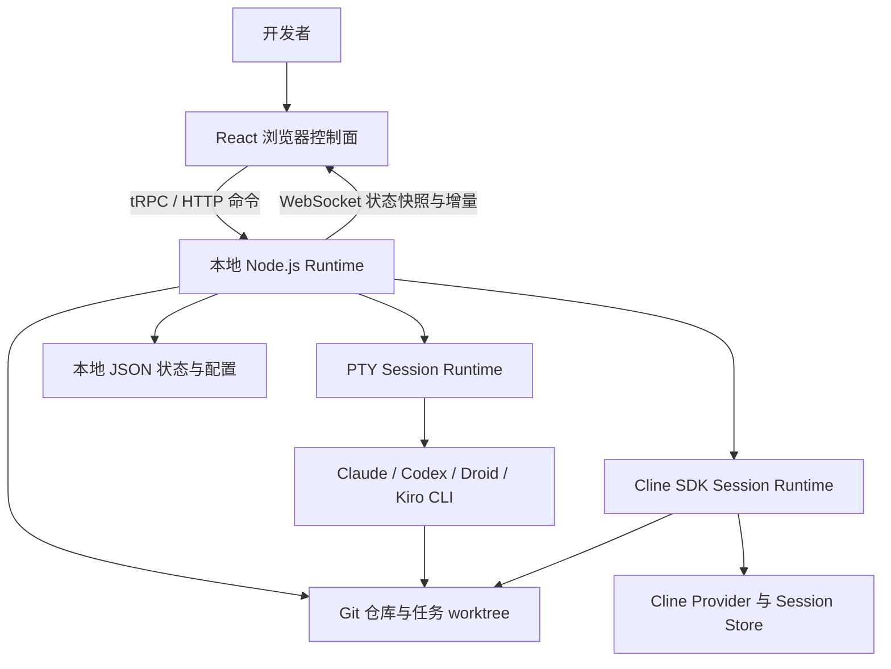

# Cline Kanban 技术产品调研

> updated_by: Codex - GPT-5
> updated_at: 2026-07-18 00:10:53
> evidence_window: 2026-07-18；`main` commit `87cfd6420344d188ae2251adf705acfd16d46be2`；npm/GitHub Release `v0.1.70`

## 交付结论

1. **Cline Kanban 是面向个人开发者和小型开发现场的本地 Agent 工作台，不是中心化任务调度服务。** 它把浏览器看板、Git worktree、Agent 终端或聊天、Diff 审阅和提交/开 PR 串成一个本地闭环。官方将其描述为“更适合并行运行多个 Agent 和审阅 Diff 的 IDE 替代品”，同时明确标注为 Research Preview。
2. **工作来源仍以显式任务为主。** 用户可以手动建卡，也可以让侧边栏 Agent 将需求拆成任务、建立依赖并启动任务。当前证据没有显示外部事件总线、周期调度器或 Agent 主动巡检环境后自行发现工作的通用机制。
3. **它的自治来自“依赖图 + 状态 Hook + 自动交付动作”，而不是一个独立调度内核。** 任务进入 Review 或 Done 后可以解锁后续任务；开启 auto-commit 或 auto-PR 后，链条可以自动继续。但 Hook 只表达 Agent 活跃或等待审阅的状态意图，并不等同于测试通过、需求满足或独立质量验证。
4. **系统是单个长驻 Node.js Runtime 加 React 浏览器控制面。** Browser 通过 tRPC/HTTP 下发命令，通过 WebSocket 接收状态和终端流；Runtime 负责项目、任务、worktree、Git 操作和 Agent 生命周期。Cline 走原生 SDK 会话路径，其他已启用 Agent 走 PTY-backed CLI 进程路径。
5. **默认基础设施很轻，但单机边界明确。** Board、Session 摘要和元数据以本地 JSON 文件持久化，写入使用文件锁、原子写和 revision 冲突检查；任务 worktree 位于用户目录。当前快照未发现外部数据库、Redis 或消息队列依赖，也未提供官方 Docker 部署清单。
6. **项目维护活跃，但产品和接口仍在快速收敛。** 仓库于 2026-03 创建，至 2026-07-12 已发布 `v0.1.70`，GitHub 页面显示 66 个 Release 和 903 次提交。近期版本持续修复并发清理、权限模式、Hook、远程访问和跨平台问题；与此同时仍处于 `0.1.x` 和 Research Preview，Electron 桌面端仅有脚手架，尚未作为可用产品发布。
7. **适用边界是“本机多个编码 Agent 的并行执行与人工审阅”。** 它目前不具备组织级任务池、分布式 Worker、租户/RBAC、持久消息队列、强制验证门禁或集中审计能力。把它直接当成无人值守的组织级调度平台，会越过现有架构和治理边界。

## 调研目标、范围与边界

### 调研目标

- 说明 Cline Kanban 为谁解决什么问题，工作如何产生、分派、推进和完成。
- 建立系统级运行模型，识别主要组件、核心链路和数据边界。
- 判断它在 Agent 自主工作议题中的能力、成熟度和治理边界。

### 核心问题

1. 产品的定位、目标用户和核心工作流是什么？
2. Agent 工作从哪里产生，如何隔离、并行、反馈和衔接？
3. 浏览器、Runtime、Agent、Git 和持久化层如何协作？
4. 安装、远程访问、外部依赖和安全边界是什么？
5. 项目是否活跃，公开反馈暴露了哪些仍在收敛的领域？

### 覆盖范围

- 唯一调研主体：[`cline/kanban`](https://github.com/cline/kanban)
- 产品资料：README、工程架构文档、开发文档、Changelog、Release、npm 包元数据
- 技术核验：只核验运行入口、Agent 执行路径、接口、持久化、通信、worktree 和远程访问
- 公开反馈：抽样查看高评论量的开放 Issue，不将个案外推为整体质量

### 明确排除

- 不做逐目录、逐路由、逐表或逐函数的源码审计。
- 不做竞品比较、选型矩阵或对 Glintz 的改造设计。
- 不安装或运行产品，不做性能、可靠性或安全渗透测试。
- 不把“源码检索未发现”写成“已证明不存在”。

## 证据口径

| 类型 | 本报告中的用法 | 边界 |
| --- | --- | --- |
| 官方产品资料 | 定位、目标流程、功能与风险提示 | 宣传性表述与架构文档、Release 或源码定点证据交叉核验 |
| 官方架构与开发文档 | 系统模型、运行模式、Hook 和遥测 | 文档可能落后于 `main`，出现冲突时单独标注 |
| 固定提交源码 | 核验当前 Agent 白名单、文件路径、接口和锁机制 | 只证明该提交快照，不外推历史和运行时稳定性 |
| GitHub/npm 快照 | 维护状态、发布节奏、公开活跃度 | 数量是 2026-07-18 快照，不等同于质量或采用率 |
| Issue 样本 | 识别重复出现的使用摩擦 | 个案和高评论样本不代表总体发生率 |
| 架构推导 | 解释部署、扩展和治理边界 | 不等同于真实负载或故障演练 |

## 产品调研

### 产品定位与目标用户

Cline Kanban 的定位不是通用项目管理看板，而是围绕 Git 仓库和编码 Agent 构建的本地开发控制面。它把每张任务卡绑定到一个 Agent Session 和一个独立 Git worktree，让用户可以同时启动多个任务、观察 Agent 最新动作、审阅各自的修改，再决定提交或开 PR。

主要目标用户是已经使用 Cline、Claude Code、Codex 等编码 Agent，希望在同一仓库内并行推进多项开发工作，同时保留可视化监控和 Diff 审阅入口的开发者。默认流程不要求登录 Kanban 账号，但实际执行仍取决于本机 Agent、模型 Provider 或 Cline 账户的安装与凭据。

### 核心工作闭环

1. 用户在 Git 仓库根目录运行 `npx kanban` 或全局 `kanban`，本地 Runtime 启动 Web Server 并打开浏览器。
2. 用户手动创建任务，或让侧边栏 Agent 通过 Kanban CLI 拆解需求、创建卡片、设置任务依赖和自动交付选项。
3. 启动任务时，Runtime 为任务创建或恢复独立 detached worktree，并把适合共享的 gitignored 路径映射到 worktree。
4. Cline 任务进入原生 SDK 会话；其他已启用 Agent 由 PTY 启动本机 CLI。每个任务在自己的 cwd 中执行，可与其他任务并行。
5. Agent Hook 或 SDK 事件把 `running`、`awaiting_review`、失败等摘要回传 Runtime；浏览器通过 WebSocket 获得快照和增量更新。
6. 用户在卡片详情中查看 TUI/Chat、完整 worktree Diff 和消息级 checkpoint Diff，也可以在代码行留下评论并发回 Agent。
7. 用户手动 Commit/Open PR，或启用 auto-commit/auto-PR。任务进入 Done 后清理 worktree，并使满足依赖条件的 Backlog 任务自动启动。

这一流程形成了“任务定义 → 隔离执行 → 状态反馈 → Diff 审阅 → Git 交付 → 后续任务解锁”的本地闭环。

### 功能地图与边界

| 功能域 | 当前能力 | 关键边界 |
| --- | --- | --- |
| 工作产生 | 手动建卡；侧边栏 Agent 拆解和建卡 | 没有通用外部事件、定时任务或环境巡检入口 |
| 分派与并行 | 每任务选择 Agent；独立 worktree 和 Session | 只调度本机 Runtime 能启动的 Agent，不是远程 Worker 池 |
| 依赖编排 | 任务之间建链；前置任务 Done 后启动后续任务 | 是轻量依赖图，不是带租约、优先级和资源配额的队列系统 |
| 执行反馈 | Hook、SDK 事件、终端输出、浏览器通知 | Hook 为 best-effort，状态变化不代表业务验收通过 |
| 人工审阅 | TUI/Chat、Diff、checkpoint、行评论、Script Shortcut | 没有默认强制 CI 或独立 verifier 门禁 |
| 自动交付 | auto-commit、auto-PR、冲突处理 Prompt | 依赖 Agent 执行 Git Prompt，不是确定性发布流水线 |
| Git 管理 | 历史、分支、fetch/pull/push、worktree 清理和恢复 | 直接作用于用户本地仓库，错误权限或 Prompt 会放大影响 |
| 远程访问 | 绑定远程 host、HTTPS、Passcode、远程项目浏览和 clone | 是单 Runtime 的远程控制，不是多租户 SaaS 控制面 |

### 自主性与人工介入

Kanban 的自主性是可逐级打开的：

- 默认可以由人创建任务、手动启动、在 Review 停住并决定是否交付。
- 侧边栏 Agent 可自主操作看板 CLI，完成任务拆解、建链和启动。
- Agent autonomous mode 会为不同 CLI 添加高权限参数。当前源码中 Codex 使用 `--dangerously-bypass-approvals-and-sandbox`，Cline 使用 `--auto-approve-all`，Droid/Kiro 也有各自的自动授权参数；Claude 自 `v0.1.69` 起改用内置 `auto` 权限模式。
- auto-commit/auto-PR 加任务依赖，可以形成“完成 → 交付 → 解锁下一任务”的无人值守链条。

官方 README 因此明确警告：产品会使用 CLI Agent 的绕过权限和 Runtime Hook 等实验性能力。报告据此判断，Kanban 提供的是**高自治执行能力加可选人工门控**，而不是默认强治理的自治系统。

### 维护状态与版本演进

截至证据窗口：

- `main` HEAD 为 `87cfd642...`，提交时间 2026-07-12，对应 `v0.1.70`。
- GitHub Release `v0.1.70` 发布于 2026-07-12；npm `latest` 同为 `0.1.70`。
- 近期方向性变化包括：服务端 PTY 状态与断线恢复、Cline 原生 SDK 路径、远程访问和 Passcode、任务级 Agent 选择、Codex Hook、自动更新、并发清理以及更安全的 Claude 自动权限模式。
- `v0.1.67` 仅宣布加入 Electron 桌面端脚手架，并明确“not yet available”；当前主要交付仍是 npm CLI 加 Web UI，PWA 只是浏览器壳，Runtime 仍需在线。

维护判断为：**活跃、快速迭代、尚未稳定**。高频 Release 和持续修复说明项目并非停滞，但 `0.1.x`、Research Preview、文档/实现差异和大量近期兼容性修复都不支持把它视为成熟基础设施。

### 生态与公开反馈

当前 `main` 的实际启动白名单为 Cline、Claude Code、Codex、Factory Droid 和 Kiro。源码目录仍保留 OpenCode 与 Gemini 定义，但在启动白名单中被临时注释；架构文档却仍将它们列为 PTY Runtime 示例。这说明 Agent 支持面正在调整，不能只依据文档名称判断当前可用性。

公开 Issue 高评论样本主要出现三类主题：

- Provider 配置与原生 Cline/TUI 行为不一致，例如 [#484](https://github.com/cline/kanban/issues/484) 的 OpenAI-compatible Provider 回归。
- 外部 CLI 在 Windows 的启动和参数兼容，例如 [#83](https://github.com/cline/kanban/issues/83) 的 Claude/Codex 命令行过长问题。
- npm 发布依赖可用性，例如 [#295](https://github.com/cline/kanban/issues/295) 的历史版本安装失败。

这些样本只能说明 Provider 适配、跨平台 PTY 和发布供应链是实际摩擦点；Issue 均来自较早版本且仍开放，不能据此断言 `v0.1.70` 必然复现，也不能推导总体故障率。

## 技术架构调研

### 系统全貌与运行形态

浏览器只是控制面，不拥有长任务的真实生命周期。Runtime 是系统的单一协调者和主要事实源，负责工作区、任务、Agent 进程、Git 操作、状态持久化和流式广播。执行层再分成两条路径：

- **PTY-backed CLI**：Runtime 启动外部 Agent 二进制，处理输入输出、窗口尺寸、退出和恢复摘要。
- **Native Cline**：Runtime 通过 `@clinebot/*` SDK 管理 Provider、OAuth、Session Host、消息和持久化历史，再映射为统一的 Kanban Task Session。

这是单节点、长驻、强状态 Runtime。远程浏览器可以连接它，但远程访问没有改变其单 Runtime 所有权模型。

### 主要组件与职责

| 组件 | 职责 | 运行位置 |
| --- | --- | --- |
| React Web UI | 看板、任务详情、Diff、终端/聊天、Git 和设置 | 浏览器/PWA |
| tRPC Runtime API | 接收浏览器和 Hook 命令，校验后路由到具体服务 | Node Runtime |
| Runtime State Hub | 汇总项目、任务、消息和元数据，广播初始快照与增量事件 | Node Runtime 内存 |
| Terminal Runtime | 启动与管理 PTY Agent 和 workspace shell | Node Runtime 子进程边界 |
| Cline Integration | 把 Cline SDK Provider/Session 语义映射到 Task Session | Node Runtime 内部 |
| Workspace/Git | worktree、Diff、checkpoint、Commit、PR Prompt 和清理 | 本地文件系统与 Git |
| State/Config | Board、Session 摘要、revision、全局/项目配置 | 本地 JSON；Cline 凭据和历史归 SDK Store |

### 核心技术链路

#### CLI Agent 任务

Browser 发起 `startTaskSession` → Runtime 确保任务 worktree → 选择 Agent Binary 和自治参数 → `prepareAgentLaunch` 注入 Hook/Wrapper → `node-pty` 在任务 cwd 启动进程 → 输出和摘要进入 State Hub → WebSocket 推送给 Board 与 Terminal。

#### Cline 原生任务

Browser 发送 Cline 消息 → tRPC Runtime API → Cline Task Session Service → SDK Session Host 与 Provider Store → SDK Event Adapter 更新 Kanban Message/Summary → State Hub 推送浏览器。Cline 的 OAuth、Provider 凭据和 Session History 由 SDK 边界拥有，Kanban 不应复制为第二份配置事实源。

#### 依赖链与自动交付

Agent Hook 发出 `to_review` → Runtime 的状态守卫接受有效转换 → 人工交付或自动 Commit/Open PR → 任务进入 Done 并计算 `readyTaskIds` → Runtime/控制面启动已解锁的 Backlog 任务。该链路有状态去重和文件锁，但没有独立的业务结果校验器。

### 主要依赖

| 依赖 | 用途 | 性质 |
| --- | --- | --- |
| Node.js | CLI、HTTP/WS Runtime、构建产物 | npm 包声明 `>=22`，是正式安装口径 |
| Git | 仓库识别、detached worktree、Diff、Commit/PR 流程 | 核心硬依赖 |
| `node-pty` / `xterm` | 外部 CLI Agent 的终端进程和状态镜像 | CLI 执行核心依赖 |
| tRPC / `ws` | Browser 命令与实时状态/终端通信 | Runtime 内置依赖 |
| `@clinebot/core` / `shared` | Cline Provider、OAuth、Session 与消息能力 | Cline 原生路径硬依赖 |
| `proper-lockfile` | JSON 状态和 worktree 设置的本地并发控制 | 单机一致性依赖 |
| Agent Binary / 模型 Provider | 实际编码执行 | 随所选 Agent 变化；Cline 原生路径不要求外部 `cline` Binary |

`DEVELOPMENT.md` 仍写 Node.js 20+，而 `package.json` 和 npm `0.1.70` 声明 Node.js `>=22`。对终端用户应以已发布包的 `>=22` 为准，文档差异属于待维护项。

### 接口形态

- **CLI**：`kanban` 启动 Runtime；`kanban task ...` 供用户或侧边栏 Agent 管理任务；`kanban hooks ingest` 接收 Agent Hook。
- **HTTP/tRPC**：Browser 和 CLI 子命令通过 `/api/trpc` 调用 Runtime。
- **WebSocket 状态流**：`/api/runtime/ws` 发送项目、Board、Session、消息和元数据快照/增量。
- **WebSocket 终端流**：`/api/terminal/io` 与 `/api/terminal/control` 分离终端数据和控制信令。
- **Browser UI/PWA**：是主要人工控制面；没有发现面向第三方系统承诺稳定性的独立公共 API 版本契约。
- **MCP**：Cline 原生路径可以配置 MCP；顶层 `kanban mcp` 已标记为 Deprecated，不应当作当前 Board 接入主接口。

### 持久化方式

Kanban 本体没有使用关系数据库。主要状态分布如下：

| 状态 | 位置/所有者 | 一致性方式 |
| --- | --- | --- |
| Workspace 索引 | `~/.cline/kanban/workspaces/index.json` | 文件锁与原子写 |
| Board / Session 摘要 / Meta | `~/.cline/kanban/workspaces/<workspaceId>/` 下的 `board.json`、`sessions.json`、`meta.json` | Workspace 锁、原子写、revision 冲突检查 |
| 全局配置 | `~/.cline/kanban/config.json` | 本地配置写入 |
| 项目配置 | `<repo>/.cline/kanban/config.json` | 项目级覆盖 |
| 任务 worktree | `~/.cline/worktrees/<taskId>/<repoName>` | Git worktree 和 setup lock |
| Cline Provider/凭据/历史 | Cline SDK Store | 由 SDK 拥有，Kanban 只做适配 |
| 活跃 PTY/Runtime Summary | Runtime 内存，部分摘要落盘 | 进程内状态流与恢复记录 |

本地 JSON 加锁足以处理同机并发写入，但没有多节点事务或共识语义。把多个 Runtime 指向同一状态目录不属于已确认支持的部署方式。

### 通信方式

- Browser 的命令请求为 tRPC over HTTP，实时状态为 WebSocket 推送。
- WebSocket 连接先获得完整 Snapshot，再接收 Workspace 级增量事件；前端断线后以 500ms 起步、最高 5s 的指数退避重连。
- PTY 输入输出通过独立 WebSocket Bridge 传输，终端状态镜像支持页面切换和重连后的画面恢复。
- Agent Hook 由包装脚本或 Agent 插件调用本地 `kanban hooks`，再通过 tRPC 通知 Runtime；Hook 被明确设计为 best-effort 和异步。
- 组件间未使用 Kafka、RabbitMQ、NATS 或 Redis。任务依赖和待处理消息由 Runtime 状态、JSON 文件和进程内结构协调，不是外部持久消息系统。

### 部署形态

#### 默认本地模式

- 在 Git 仓库中运行 `npx kanban`，或 `npm i -g kanban` 后运行 `kanban`。
- Runtime 默认监听 `127.0.0.1:3484`，也可自动选择端口；构建后的 React 静态资源由同一 Runtime 提供。
- 最小前置条件是 Node.js 22+、npm、Git、浏览器，以及所选外部 CLI Agent；Cline 原生路径还需要可用 Provider 配置。

#### 远程 Runtime 模式

- `--host` 可绑定非 loopback 地址；远程模式默认生成一次性显示的 Passcode，并对 HTTP/WS 使用 Session Token。
- 可用 `--https --cert --key` 提供 TLS；`--no-passcode` 只适合已有反向代理和鉴权层的高级部署。
- Runtime 实现 Host/Origin 校验、Passcode 尝试限流和 WebSocket 鉴权。
- 这仍是单个 Node Runtime。Passcode 是访问门槛，不等同于用户、角色、租户或细粒度权限系统。

#### 尚未确认的正式形态

- 当前仓库有 Electron 私有包和运行子进程代码，但 Release 明确说明桌面应用尚不可用。
- PWA 可以独立成窗口并提供离线 fallback 页面，但 Agent 和 Git 能力依赖 Runtime 重新连通，不能视为离线客户端。
- 当前快照未发现官方 Dockerfile/Compose；源码运行文档存在，但不是正式容器部署承诺。

### 网络、遥测与安全边界

- 官方 Release 构建会注入 PostHog 配置，默认 Host 为 `https://data.cline.bot`；源码构建未提供 Key 时不初始化 PostHog。Sentry 用于错误捕获和 Release sourcemap。
- Agent 本身会访问对应模型 Provider、OAuth、MCP 或代码托管服务；“Kanban 无账号启动”不等于完整工作流完全离线。
- worktree 会映射 gitignored 路径以减少重复安装。README 明确提示：如果任务会修改这类共享路径，就不应使用该模式。
- Codex 等高权限自治参数可能绕过本机审批或沙箱。远程开放 Runtime 时，应把 Git 凭据、Shell 权限和 Provider Secret 一并视为受保护资产。

## 对 Agent 自主工作议题的判断

| 观察维度 | Cline Kanban 当前形态 | 成熟度判断 |
| --- | --- | --- |
| 工作产生 | 人工建卡或侧边栏 Agent 拆解 | 已可用，但仍是显式请求驱动 |
| 工作分派 | 按任务选择本机 Agent | 已可用；不含 Worker 资源调度 |
| 并行隔离 | 每任务独立 worktree 和 Session | 产品核心能力，单机范围内较完整 |
| 持续推进 | Hook/SDK 状态、依赖解锁、自动交付 | 可形成长链，但依赖 best-effort Hook 和 Agent Prompt |
| 完成反馈 | Review、Diff、通知、Commit/PR、Done | 人工反馈面完整，机器验收较弱 |
| 人工介入 | Review、行评论、权限提示、手动交付 | 默认可保留；自治模式可主动绕过 |
| 治理与审计 | 本地 Board、Git 历史、Session 摘要 | 缺少组织级 RBAC、策略、集中审计和租户隔离 |
| 故障恢复 | JSON 持久化、Session 恢复、worktree Patch、WS 重连 | 面向单机交互恢复；无分布式容灾证据 |

综合判断：Cline Kanban 已经把“多个 Agent 如何在同一代码库中获得任务、隔离执行、反馈状态、接受审阅并衔接后续工作”做成了可操作产品。它最有价值的工程模式是以 Git worktree 作为任务隔离单元、以 Runtime Hook 作为工作状态桥梁、以 Diff/Review 作为 Human Handoff 面、以依赖图和 auto-review 作为有限自治编排。其尚未解决的是独立质量判定、跨节点调度、组织治理和可证明的可靠完成语义。

## 未决项与证据边界

1. **运行验证未做**：没有实际启动 `v0.1.70`，因此安装成功率、并发上限、终端恢复和远程访问只确认设计与公开资料，未确认运行表现。
2. **Agent 支持文档有差异**：架构文档列出 Gemini/OpenCode，当前源码启动白名单却禁用二者并加入 Kiro；应以具体 Release 的 UI/源码为准。
3. **完成语义未形成强保证**：Hook 到 Review、自动 Git 交付和依赖解锁都已确认，但没有发现默认强制测试、独立 verifier 或策略引擎。
4. **规模边界未量化**：README 的“hundreds of agents”是产品表述；没有 benchmark 或资源模型，不能当作已验证容量。
5. **远程模式不是组织治理**：已确认 Passcode、TLS 和 Host/Origin 检查，但未发现 RBAC、多租户、集中 Secret 管理或审计保留策略。
6. **正式平台支持矩阵未发现**：Changelog 有 Windows、macOS、Linux 修复，不能由此推导每个平台和 Shell 的完整支持承诺。

## 后续验证建议

如后续需要把调研推进到运行验证，建议只验证会改变上述结论的事项：

1. 在隔离测试仓库中验证 `v0.1.70` 的安装、Node 版本要求和五个当前启用 Agent 的真实可用性。
2. 构造“并行任务 + 依赖链 + auto-commit + Agent 失败”场景，观察错误是否会阻断后续任务以及 Review 状态是否可靠。
3. 中断并重启 Runtime，验证 PTY、Cline Session、worktree Patch 和 Board revision 的恢复边界。
4. 在远程模式验证 TLS、Passcode、Cookie/WS 鉴权和反向代理部署，不扩大为安全审计。
5. 核对官方 Release 构建的 PostHog/Sentry 实际网络请求和可关闭方式。

## 主要证据锚点

- [README：产品定位、核心流程与 Research Preview 警告](https://github.com/cline/kanban/blob/87cfd6420344d188ae2251adf705acfd16d46be2/README.md)
- [Architecture：系统模型、两类 Agent Runtime 与状态所有权](https://github.com/cline/kanban/blob/87cfd6420344d188ae2251adf705acfd16d46be2/docs/architecture.md)
- [Development：Runtime Hook、开发运行和遥测口径](https://github.com/cline/kanban/blob/87cfd6420344d188ae2251adf705acfd16d46be2/DEVELOPMENT.md)
- [package.json：发布版本、Node 引擎和主要依赖](https://github.com/cline/kanban/blob/87cfd6420344d188ae2251adf705acfd16d46be2/package.json)
- [Agent Catalog：当前 Agent 定义、自治参数与启动白名单](https://github.com/cline/kanban/blob/87cfd6420344d188ae2251adf705acfd16d46be2/src/core/agent-catalog.ts)
- [Workspace State：JSON 持久化、文件锁与 revision](https://github.com/cline/kanban/blob/87cfd6420344d188ae2251adf705acfd16d46be2/src/state/workspace-state.ts)
- [Runtime Server：tRPC、WebSocket、远程 Passcode 与 TLS](https://github.com/cline/kanban/blob/87cfd6420344d188ae2251adf705acfd16d46be2/src/server/runtime-server.ts)
- [Changelog：版本演进](https://github.com/cline/kanban/blob/87cfd6420344d188ae2251adf705acfd16d46be2/CHANGELOG.md)
- [GitHub Releases：`v0.1.70` 与近期发布记录](https://github.com/cline/kanban/releases)
- [npm：`kanban@0.1.70`](https://www.npmjs.com/package/kanban/v/0.1.70)
- [Apache-2.0 License](https://github.com/cline/kanban/blob/87cfd6420344d188ae2251adf705acfd16d46be2/LICENSE)
